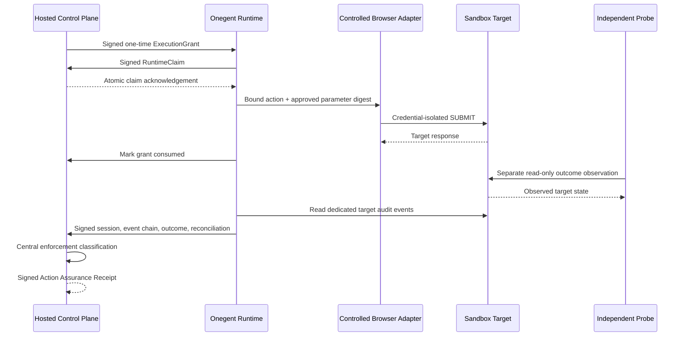

# Browser Enforcement Boundary v0.2

Status: reference profile implemented for one credential-isolated Browser sandbox adapter.

`BROWSER_ENFORCED_V0_2` closes the gap between a Hosted approval and the browser write that actually reaches a target system. It is deliberately action-scoped. It does not claim that an entire agent, browser, account, or network is universally controlled.

## Trust protocol



The Hosted control plane signs a short-lived `ExecutionGrant` bound to the tenant, action digest, mandate, policy decision, approvals, agent build, runtime identity, adapter/version, target origins, operation, resource, final parameters, and outcome predicate. The runtime proves possession of its registered Ed25519 key before the store atomically redeems the grant.

## Required proof

An action is `ENFORCED` only when every central check passes:

1. Hosted grant signature, TTL-at-claim, and binding fields verify.
2. Exactly one atomic claim reaches `CONSUMED`.
3. Runtime identity is active and proves key possession.
4. Session attestation matches the grant, adapter version, and target origins.
5. Credentials remain in a registered adapter boundary and the lease is revoked.
6. No credential-shaped values appear in evidence.
7. Required events are ordered, signed, strictly sequenced, and hash-linked.
8. Final submitted parameters match the approved digest.
9. A separate read-only probe observes the target outcome.
10. Dedicated target audit events reconcile one-to-one with the approved action.
11. Tenant, runtime capability, and adapter bindings match.

The caller cannot set `enforcementLevel` or `assuranceProfile`. `classifyBrowserEnforcement()` derives both from verified server and runtime records.

Runtime identities have an explicit trust lifecycle. Owners can suspend, revoke, or mark a key compromised with an `effectiveAt` timestamp. Evidence created before a later routine suspension or revocation remains historically verifiable; a compromise effective before an execution invalidates that execution's runtime-trust check.

## Credential boundary

The reference adapter uses a target-scoped sandbox write credential held only in the adapter closure. The agent receives no secret, cookie, token, or raw credential argument. Evidence stores only an opaque SHA-256 reference. A separate read credential is held by the outcome probe.

This is not a general secret vault. Production adapters must provide a customer-owned credential provider, bounded target scope, rotation, and target-side audit source. The reference profile does not permit `AGENT_PROVIDED_SECRET`, prompt secrets, tool-argument secrets, or unknown isolation.

## Failure behavior

- Replayed or concurrently claimed grants return `execution_grant_replay`.
- Revoked or expired grants fail before adapter execution.
- Agent build, adapter version, origin, target, predicate, or parameter drift fails closed.
- Missing, duplicate, reordered, tampered, or unsigned events downgrade the action.
- Missing or unmatched target audit events produce `RECONCILIATION_INCOMPLETE` or `BYPASS_DETECTED`.
- A verified but incorrect business outcome may still have an enforced execution boundary; outcome satisfaction remains a separate receipt fact.

## Run the reference slice

```bash
npm run browser-enforcement:e2e
```

The deterministic local target performs no real purchase, payment, email, or production write. The test covers the happy path plus replay, parameter mutation, revocation, signature/binding tamper, bypass detection, and secret scanning.

## Compatibility

Action Assurance Receipt v0.1 remains backward compatible. Older receipts and integrations continue to verify as `SELF_REPORTED` or `OBSERVED_ONLY`. New optional Browser v0.2 fields are required only when a receipt claims `BROWSER_ENFORCED_V0_2`.
